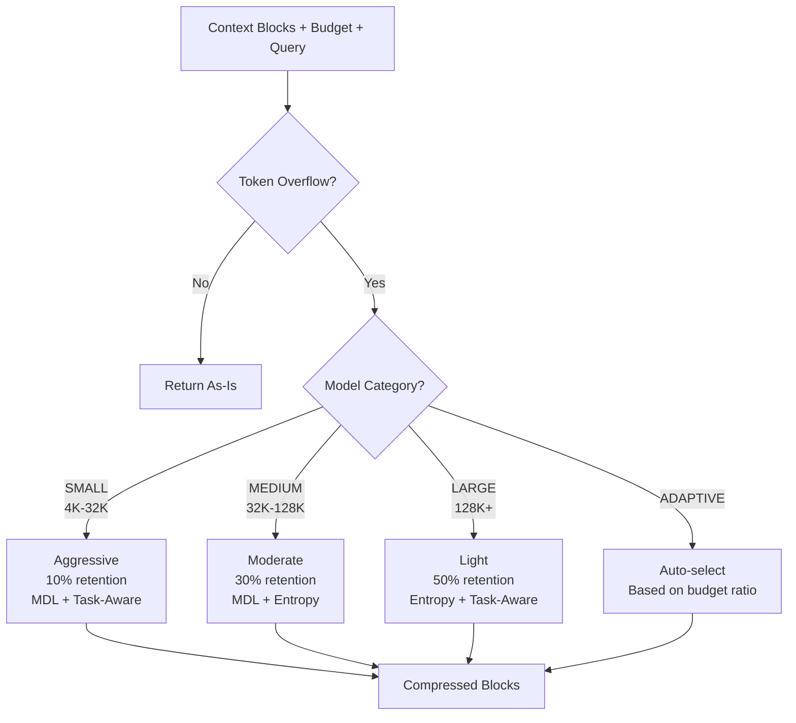

# Adaptive Compression

UCEF provides three complementary compression strategies that work together through the adaptive compressor. Each strategy is grounded in information theory and optimized for different aspects of the context selection problem.

---

## The Compression Problem

Given a set of context blocks $\{b_1, \ldots, b_n\}$ with total tokens $T = \sum_i t_i$ and a token budget $B < T$, select a subset that maximizes information content within the budget.

This is a constrained optimization problem:

$$\max_{S \subseteq \{1,\ldots,n\}} \text{Info}(S) \quad \text{subject to} \quad \sum_{i \in S} t_i \leq B$$

UCEF solves this with three strategies, each optimizing a different objective.

---

## Strategy 1: MDL Compression

**Module**: `ucef.compression.mdl.MDLCompressor`

The Minimum Description Length (MDL) principle selects blocks that minimize the total description cost of the context given the query.

### Mathematical Formulation

For each block $b_i$, compute:

$$\text{MDL}(b_i) = w \cdot L(b_i) + (1 - w) \cdot L(q \mid b_i)$$

where:

#### $L(b_i)$: Self-description length

The cost of describing block $b_i$'s word distribution:

$$L(b_i) = -\frac{1}{|b_i|} \sum_{w \in b_i} \log_2 P(w)$$

where $P(w) = \frac{\text{count}(w)}{\text{total\_words}}$ is the global word frequency.

Lower $L(b_i)$ means the block contains common, well-compressed words. Higher $L(b_i)$ means the block has rare, specific vocabulary.

#### $L(q \mid b_i)$: Conditional description length

The cost of describing the query $q$ given that block $b_i$ is known:

$$L(q \mid b_i) = \begin{cases} -\log_2(\text{coverage}(q, b_i)) & \text{if } \text{coverage} > 0 \\ \log_2(|q| + 1) & \text{otherwise} \end{cases}$$

where $\text{coverage}(q, b_i) = \frac{|q \cap b_i|}{|q|}$ is the fraction of query terms found in the block.

Lower $L(q \mid b_i)$ means the block is highly relevant to the query (query terms appear in the block).

#### MDL Per Token

The final score is normalized by token count to prefer compact information:

$$\text{MDL}_{\text{per\_token}}(b_i) = \frac{\text{MDL}(b_i)}{t_i}$$

Blocks are selected in ascending order of $\text{MDL}_{\text{per\_token}}$ (lower is better).

### Sentence-Level Compression

For individual block compression, UCEF uses sentence-level selection:

1. Split block into sentences
2. Score each sentence: $\text{score} = 0.4 \cdot \text{overlap} + 0.3 \cdot \text{position} + 0.3 \cdot H(s)$
3. Select top-$k$ sentences where $k = \lceil|S| \cdot r\rceil$ and $r$ is the target ratio

### Self-Information

The self-information of a sentence measures its information density:

$$H(s) = -\sum_{w \in s} P(w|s) \log_2 P(w|s)$$

Higher entropy sentences contain more diverse, information-rich vocabulary.

---

## Strategy 2: Entropy Compression

**Module**: `ucef.compression.entropy.EntropyCompressor`

The entropy compressor maximizes information diversity in the selected context, inspired by Maximal Marginal Relevance (Carbonell & Goldstein, 1998).

### Objective

$$\max_S H(S) \quad \text{subject to} \quad \sum_{i \in S} t_i \leq B$$

### Greedy Selection

At each step, select the block that maximizes:

$$\text{score}(b_i) = (1 - \lambda) \cdot \text{relevance}(b_i) + \lambda \cdot \text{diversity}(b_i)$$

where:

- $\text{relevance}(b_i) = \frac{|W(b_i) \cap W(q)|}{|W(q)|}$ is the query relevance (word overlap)
- $\text{diversity}(b_i) = 1 - \max_{j \in S} J(b_i, b_j)$ is the marginal diversity
- $\lambda = 0.3$ is the diversity weight (configurable)
- $J(b_i, b_j) = \frac{|W(b_i) \cap W(b_j)|}{|W(b_i) \cup W(b_j)|}$ is Jaccard similarity

### Properties

- The first selected block has maximum diversity (score = 1.0)
- Subsequent blocks are penalized for redundancy with already-selected blocks
- Greedy selection has $O(n \cdot k)$ complexity where $k$ = number of selected blocks
- The result is a diverse, non-redundant subset

### Block Entropy

The entropy compressor also provides a per-block entropy measure:

$$H(b) = -\sum_{w \in b} P(w) \log_2 P(w)$$

This measures the information content of each block in bits per word.

---

## Strategy 3: Task-Aware Compression

**Module**: `ucef.compression.task_aware.TaskAwareCompressor`

Task-aware compression extracts the most query-relevant sentences from each block, providing fine-grained compression that preserves task-critical information.

### Sentence Scoring

Each sentence is scored on three dimensions:

$$\text{score}(s_i) = \text{overlap}(s_i) \times \text{position}(s_i) \times \text{length}(s_i)$$

| Dimension | Computation | Rationale |
|-----------|-------------|-----------|
| **Word overlap** | $\frac{|W(s) \cap W(q)|}{|W(q)|}$ | Direct query relevance |
| **Position** | First sentence: 1.2, Last: 1.1, Middle: 1.0 | Topic sentences are more important |
| **Length** | Medium (5-30 words): 1.0, Short (<5): 0.5, Long (>30): 0.8 | Prefer concise, complete sentences |

### Pipeline

1. **Split** each block into sentences
2. **Score** each sentence for query relevance
3. **Select** top-$k$ sentences per block ($k = \lceil|S| \times 0.6\rceil$, configurable)
4. **Reorder** selected sentences by original position for coherence
5. **Budget** - Select complete blocks by information density within token budget

### LLM-Based Summarization

When a model client is available, the task-aware compressor can optionally use the LLM to generate concise summaries for maximum compression. This provides an additional 20-30% compression beyond sentence extraction.

---

## Adaptive Compressor

**Module**: `ucef.compression.adaptive.AdaptiveCompressor`

The adaptive compressor selects and combines strategies based on the model's context category:



### Strategy Mapping

| Context Category | Native Window | Primary Strategy | Retention | Compressors Used |
|-----------------|:------------:|-----------------|:---------:|:----------------:|
| SMALL | 4K - 32K | Aggressive | 10% | MDL + Task-Aware |
| MEDIUM | 32K - 128K | Moderate | 30% | MDL + Entropy |
| LARGE | 128K - 200K | Light | 50% | Entropy + Task-Aware |
| XLARGE | 200K+ | Light | 50% | Entropy + Task-Aware |
| (any) | (any) | Adaptive | Dynamic | All three |

### Compression Ratios

| Strategy | Retention | Typical Quality Retention |
|----------|:---------:|:------------------------:|
| Aggressive | 10% | ~64% of original |
| Moderate | 30% | ~66-72% of original |
| Light | 50% | ~73% of original |
| Adaptive | Dynamic | Up to ~96% of original |

---

## Complexity Comparison

| Compressor | Time Complexity | Space Complexity |
|-----------|:---------------:|:----------------:|
| MDL | $O(n \cdot m + n \log n)$ | $O(m)$ |
| Entropy | $O(n \cdot k)$ | $O(n^2)$ |
| Task-Aware | $O(n \cdot s)$ | $O(s)$ |
| Adaptive | Worst of selected | Sum of selected |

Where: $n$ = number of blocks, $m$ = average words per block, $k$ = selected blocks, $s$ = sentences per block.

---

## Benchmark Latency

From simulated experiments:

| Stage | Mean | P95 |
|-------|:----:|:---:|
| Retrieval | 0.02ms | 0.03ms |
| Selection | 8.79ms | 8.96ms |
| Compression | 0.42ms | 0.44ms |
| **Total Pipeline** | **9.21ms** | **9.47ms** |

Compression adds negligible overhead (~0.42ms mean) compared to selection (~8.79ms).

---

## Configuration

```python
from ucef.core.config import CompressionConfig

config = CompressionConfig(
    default_strategy="adaptive",    # Let UCEF choose
    aggressive_ratio=0.10,          # 10% retention for small models
    moderate_ratio=0.30,            # 30% for medium models
    light_ratio=0.50,               # 50% for large models
    use_mdl=True,                   # Enable MDL compression
    description_length_weight=0.5,  # Balance L(block) vs L(query|block)
    use_entropy=True,               # Enable entropy compression
    entropy_threshold=0.8,          # Minimum entropy for block retention
)
```

---

## References

1. Grunwald, P. (2007). "The Minimum Description Length Principle." *MIT Press*.
2. Jaynes, E.T. (1957). "Information Theory and Statistical Mechanics." *Physical Review*.
3. Carbonell, J. & Goldstein, J. (1998). "The Use of MMR, Diversity-Based Reranking for Reordering Documents and Producing Summaries." *SIGIR 1998*.
4. Jiang, H. et al. (2023). "LLMLingua: Compressing Prompts for Accelerated Inference of Large Language Models." *EMNLP 2023*.

---

*Previous: [Quantum Selection](quantum.md) | Next: [Quality Assurance](quality.md)*
