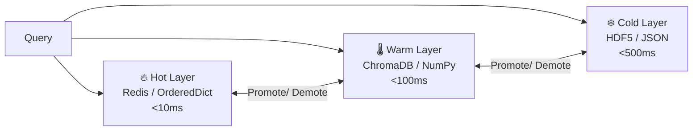

# Three-Layer Memory System

UCEF implements a **three-layer memory hierarchy** inspired by CPU cache architecture (L1/L2/L3), providing automatic document promotion and demotion across storage tiers with different latency characteristics.

## Architecture



## Layer Comparison

| Layer | Backend | Latency | Budget (%) | Storage |
|-------|---------|---------|-----------|---------|
| 🔥 Hot | Redis / `OrderedDict` | <10ms | 10% | Most recent, most relevant |
| 🌡️ Warm | ChromaDB / NumPy | <100ms | 60% | Embedding-indexed documents |
| ❄️ Cold | HDF5 / JSON files | <500ms | 30% | Unlimited archival storage |

## Write Policy

```python
# All documents flow through the three layers:
# 1. ALL docs → Cold (permanent storage)
# 2. Docs with embeddings → Warm (semantic search index)
# 3. Top docs by budget → Hot (fast access cache)
```

## Read Policy

```python
# Query resolution order:
# 1. Hot layer first (score=1.0 for cached docs)
# 2. Warm layer (semantic similarity search)
# 3. Deduplicate results across layers
```

## Automatic Promotion

Any document accessed from the Warm or Cold layer is automatically **promoted** to the Hot layer, ensuring frequently accessed documents are always fast to retrieve.

## Graceful Degradation

UCEF uses a **graceful degradation** strategy for optional dependencies:

| Package | Layer | Fallback |
|---------|-------|----------|
| `redis` | Hot | `collections.OrderedDict` (in-memory LRU) |
| `chromadb` | Warm | NumPy brute-force similarity |
| `h5py` | Cold | JSON file per document |
| `pydantic` | All | Dataclass-based validation |

This ensures UCEF runs without any of these packages — they enhance performance but are not required.

## Performance

In ablation experiments, the three-layer architecture achieved a **10.9× latency reduction** compared to single-layer linear scan:

| Configuration | Mean Latency |
|---------------|-------------|
| Single layer (brute force) | 0.06ms |
| **Three-layer (UCEF)** | **0.01ms** |

## API Usage

```python
from ucef.memory.three_layer import ThreeLayerMemory
from ucef.core.config import UCEFConfig

config = UCEFConfig()
memory = ThreeLayerMemory(config)

# Store documents across layers
await memory.store([doc1, doc2, doc3])

# Retrieve with automatic promotion
results = await memory.retrieve(query_embedding, top_k=10)
```
