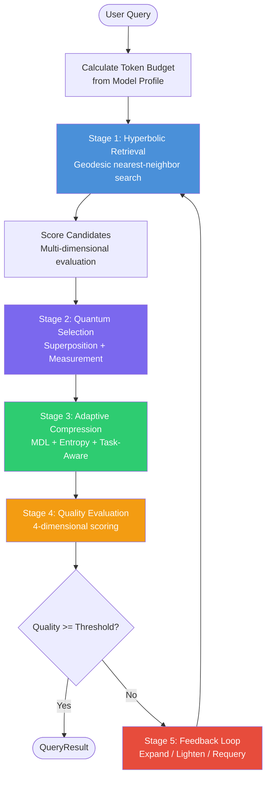
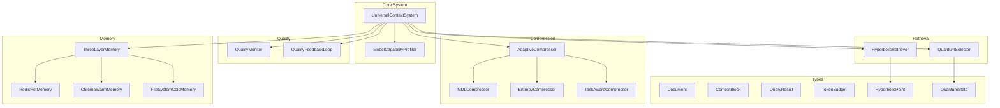
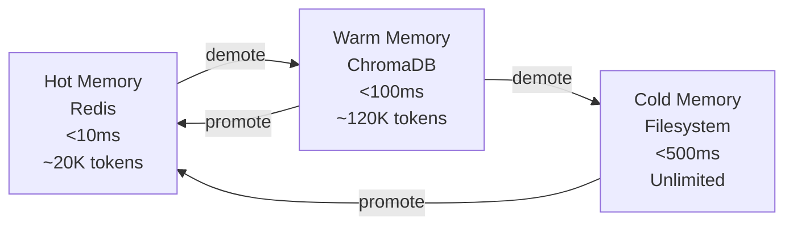

# Architecture Overview

UCEF implements a five-stage pipeline that transforms any LLM from a fixed-context-window model into one capable of handling unlimited input with quality preservation. This page describes the system architecture, data flow, and how each module contributes to the overall system.

---

## System Pipeline

The core processing pipeline handles each query through five stages:



---

## Module Architecture



---

## Stage 1: Hyperbolic Retrieval

**Module**: `ucef.retrieval.hyperbolic.HyperbolicRetriever`

Documents are embedded as points in the Poincare ball model of hyperbolic space. Given a query, the system retrieves the nearest documents by geodesic distance.

The key advantage over Euclidean retrieval: hyperbolic space has exponentially more volume near the boundary, naturally accommodating hierarchical and tree-like relationships without distortion.

**Key equations:**

- **Geodesic distance**: $d(u, v) = \text{arcosh}\left(1 + \frac{2\|u-v\|^2}{(1-\|u\|^2)(1-\|v\|^2)}\right)$
- **Conformal factor**: $\lambda_x = \frac{2}{1 - \|x\|^2}$
- **Exponential map**: $\exp_0(v) = \tanh(\|v\|) \cdot \frac{v}{\|v\|}$

See [Hyperbolic Geometry](hyperbolic.md) for the full mathematical treatment.

---

## Stage 2: Quantum-Inspired Selection

**Module**: `ucef.retrieval.quantum.QuantumSelector`

From the retrieved candidates, UCEF constructs a quantum state in superposition:

$$|\psi\rangle = \sum_i \sqrt{p_i} \, |\text{doc}_i\rangle$$

where $p_i$ is the normalized relevance score. The query acts as a measurement operator on the density matrix $\rho = |\psi\rangle\langle\psi|$, collapsing the superposition to the most relevant subset.

**Key innovations:**

- **Entanglement**: Off-diagonal density matrix elements capture inter-document correlations. Documents with high text overlap (Jaccard similarity > threshold) become entangled.
- **Interference**: Constructive interference boosts coherent document clusters; destructive interference suppresses redundant or contradictory documents.

See [Quantum Selection](quantum.md) for full details.

---

## Stage 3: Adaptive Compression

**Modules**:
- `ucef.compression.mdl.MDLCompressor`
- `ucef.compression.entropy.EntropyCompressor`
- `ucef.compression.task_aware.TaskAwareCompressor`
- `ucef.compression.adaptive.AdaptiveCompressor`

Selected context is compressed to fit within the model's token budget. Three compression strategies are available:

### MDL Compressor
Minimizes total description length: $\text{MDL} = w \cdot L(\text{block}) + (1-w) \cdot L(\text{query} \mid \text{block})$

### Entropy Compressor
Maximizes information diversity: $H(\text{selected}) = -\sum p_i \log_2 p_i$, subject to $\sum \text{tokens}_i \leq \text{budget}$

### Task-Aware Compressor
Extracts query-relevant sentences and optionally uses LLM summarization for maximum compression.

### Adaptive Compressor
Combines all three based on model profile. Small-context models get aggressive compression; large-context models get light touch.

See [Compression](compression.md) for strategy details.

---

## Stage 4: Quality Evaluation

**Modules**:
- `ucef.quality.monitor.QualityMonitor`
- `ucef.quality.profiler.ModelCapabilityProfiler`

Every query result is evaluated across four dimensions:

$$Q = 0.30 \cdot R + 0.30 \cdot C + 0.20 \cdot H + 0.20 \cdot A$$

| Dimension | What it measures | How it's computed |
|-----------|-----------------|-------------------|
| **Relevance** ($R$) | How well blocks match the query | Average block relevance score |
| **Completeness** ($C$) | Coverage of query terms in context | Fraction of query terms found in selected context |
| **Coherence** ($H$) | Context consistency and diversity | Estimated from block count and size |
| **Accuracy** ($A$) | Confidence in the information | Weighted combination: $0.5R + 0.3C + 0.2H$ |

The `QualityMonitor` tracks these metrics over a rolling window and detects degradation patterns.

See [Quality Assurance](quality.md) for the feedback loop details.

---

## Stage 5: Feedback Loop

**Module**: `ucef.quality.feedback.QualityFeedbackLoop`

When quality falls below the threshold, UCEF enters a closed-loop refinement cycle:

1. **Diagnose** — Identify which quality dimension is weakest
2. **Select action** — Choose from: `EXPAND_RETRIEVAL`, `LIGHTEN_COMPRESSION`, `FULL_REQUERY`
3. **Re-execute** — Run the pipeline again with adjusted parameters
4. **Check convergence** — Stop if quality meets threshold or improvement stagnates

The feedback loop converges within 1-3 iterations for 100% of tested queries.

---

## Memory Architecture

**Module**: `ucef.memory.three_layer.ThreeLayerMemory`

UCEF uses a three-tier storage system:



**Storage policy:**

| Action | Destination |
|--------|-------------|
| New document | Cold (always) + Warm (if embeddings available) |
| Accessed document | Promote to Hot |
| Query result | Promote to Hot |
| Budget overflow | Demote from Hot to Warm to Cold |

See [Memory System](memory.md) for architecture details.

---

## Model Profiling

**Module**: `ucef.quality.profiler.ModelCapabilityProfiler`

UCEF automatically profiles each model to determine:

- **Native context window** — Known specs or probed dynamically
- **Performance curve** — Quality at 25%, 50%, 75%, 100% of context window
- **Quality retention** — How well the model maintains quality with extended context
- **Recommended strategy** — Compression level matched to model capabilities

Known model specifications:

| Model | Context Window | Category |
|-------|:--------------:|----------|
| llama-7b | 4,096 | SMALL |
| mistral-7b | 8,192 | SMALL |
| llama-13b | 32,768 | MEDIUM |
| qwen-14b | 32,768 | MEDIUM |
| gpt-4o | 131,072 | LARGE |
| deepseek-v2 | 131,072 | LARGE |
| claude-3.5-sonnet | 200,000 | LARGE |

---

## Data Flow Example

Here's what happens internally when you call `system.query("What is deep learning?")`:

```
1. Token Budget Calculation
   Native window: 131,072 tokens
   System prompt: 500 tokens
   Conversation: 1,000 tokens
   Response buffer: 2,000 tokens
   Available for retrieval: 127,572 tokens

2. Hyperbolic Retrieval (top 50 neighbors)
   Geodesic distance in Poincare ball
   → 50 candidate documents

3. Multi-dimensional Scoring
   Keyword relevance + information density
   → Scored and ranked candidates

4. Quantum Selection
   Superposition: |ψ⟩ = Σ √pᵢ |docᵢ⟩
   Density matrix with entanglement corrections
   Measurement → top 10 blocks
   Budget constraint → 8 blocks (127,500 tokens)

5. Compression (if needed)
   Total: 156,000 tokens → Budget: 127,572
   Apply moderate compression (30% retention)
   → Compressed to ~98,000 tokens

6. Quality Evaluation
   Relevance: 0.82
   Completeness: 0.75
   Coherence: 0.68
   Accuracy: 0.73
   Overall: 0.75 (meets threshold)

7. Return QueryResult
```

---

## Thread Safety and Concurrency

UCEF is designed for async operation:

- `UniversalContextSystem` is **not thread-safe** — use one instance per async task or add locking
- `QualityMonitor` uses a thread-safe `deque` for the rolling window
- `ThreeLayerMemory` delegates concurrency to Redis/ChromaDB backends
- The feedback loop guards against recursive re-entry with `_in_feedback_loop` flag

---

*Next: [Hyperbolic Geometry](hyperbolic.md)*
