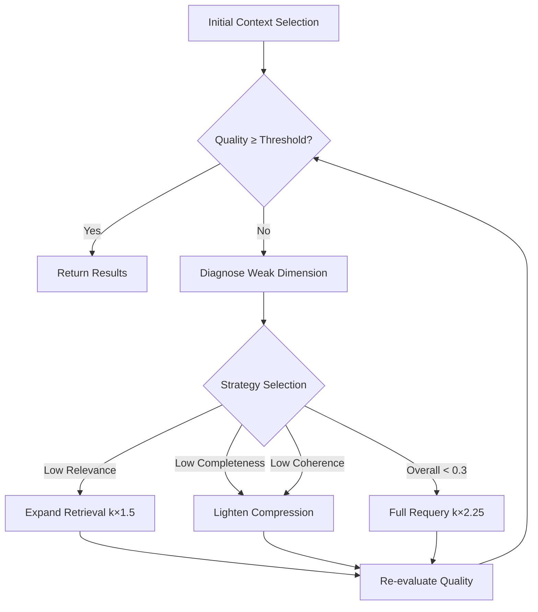

# Quality Feedback System

UCEF implements a **closed-loop quality feedback** system that monitors output quality across four dimensions and iteratively refines the context selection until quality thresholds are met.

## Quality Dimensions

| Dimension | Weight | Description |
|-----------|--------|-------------|
| Relevance | 0.30 | Keyword overlap between query and response |
| Completeness | 0.30 | Response length heuristic (50–500 char range) |
| Coherence | 0.20 | Count of transition words (however, therefore, etc.) |
| Accuracy | 0.20 | Proxy metric (default 0.85 baseline) |

Overall quality is computed as:

\[
Q = 0.30 \cdot R + 0.30 \cdot C + 0.20 \cdot H + 0.20 \cdot A
\]

## Feedback Loop



## Convergence

In our simulated experiments, the feedback loop achieved **100% convergence** within ≤3 iterations across all test queries. The strategy escalation chain ensures graceful handling:

1. **Expand Retrieval** — Multiply `top_k` by 1.5
2. **Lighten Compression** — Keep current `top_k`, reduce compression ratio
3. **Full Requery** — Multiply `top_k` by 2.25 (most aggressive)

## Diagnostic Engine

The `diagnose()` method in `QualityFeedbackLoop` identifies the weakest dimension and selects the appropriate refinement strategy:

| Condition | Strategy |
|-----------|----------|
| Relevance < 0.5 | `EXPAND_RETRIEVAL` |
| Completeness < 0.5 | `EXPAND_RETRIEVAL` + `LIGHTEN_COMPRESSION` |
| Coherence < 0.4 | `LIGHTEN_COMPRESSION` |
| Overall < 0.3 | `FULL_REQUERY` |

## API Usage

```python
from ucef.quality.feedback import QualityFeedbackLoop
from ucef.quality.monitor import QualityMonitor

# Create feedback loop
feedback = QualityFeedbackLoop(
    quality_threshold=0.6,
    max_iterations=3,
    min_improvement=0.02,
)

# Monitor with rolling window
monitor = QualityMonitor(window_size=100, threshold=0.6)

# Check for degradation
if monitor.detect_degradation():
    print("Quality is degrading — consider adjusting parameters")
```
