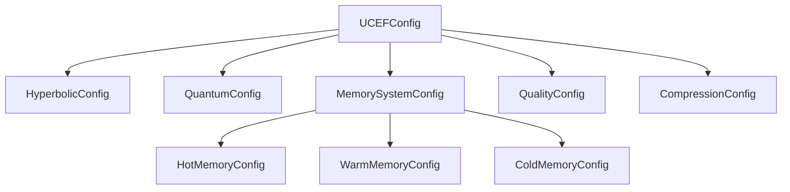

# Configuration Reference

UCEF provides a hierarchical configuration system with sensible defaults for every parameter. Configurations can be created programmatically, loaded from YAML/JSON files, or set via environment variables.

---

## Configuration Hierarchy



---

## Creating a Configuration

### Default configuration

```python
from ucef.core.config import UCEFConfig

config = UCEFConfig()
```

### From Python

```python
from ucef.core.config import (
    UCEFConfig,
    HyperbolicConfig,
    QuantumConfig,
    QualityConfig,
    CompressionConfig,
    MemorySystemConfig,
)

config = UCEFConfig(
    project_name="my-project",
    target_extended_context=2_000_000,
    max_retrieval_time_ms=1000.0,
    log_level="DEBUG",
    hyperbolic=HyperbolicConfig(
        embedding_dim=256,
        curvature=-1.0,
        n_neighbors=100,
    ),
    quantum=QuantumConfig(
        enabled=True,
        initial_amplitude="relevance_weighted",
        top_k_measurements=15,
        use_interference=True,
    ),
    quality=QualityConfig(
        quality_threshold=0.80,
        max_regeneration_attempts=5,
    ),
    compression=CompressionConfig(
        default_strategy="adaptive",
        use_mdl=True,
        use_entropy=True,
    ),
)
```

### From YAML file

```yaml
# ucef_config.yaml
project_name: production-deployment
target_extended_context: 2000000
max_retrieval_time_ms: 500.0
log_level: INFO
data_dir: /var/lib/ucef/data
cache_dir: /var/lib/ucef/cache

hyperbolic:
  embedding_dim: 128
  curvature: -1.0
  max_norm: 0.9
  learning_rate: 0.01
  n_epochs: 100
  n_neighbors: 50

quantum:
  enabled: true
  initial_amplitude: relevance_weighted
  entanglement_threshold: 0.3
  measurement_method: top_k
  top_k_measurements: 10
  use_interference: true

quality:
  quality_threshold: 0.75
  relevance_weight: 0.30
  completeness_weight: 0.30
  coherence_weight: 0.20
  accuracy_weight: 0.20
  max_regeneration_attempts: 3
  use_self_consistency: true
  consistency_samples: 5

compression:
  default_strategy: adaptive
  aggressive_ratio: 0.10
  moderate_ratio: 0.30
  light_ratio: 0.50
  use_mdl: true
  use_entropy: true

memory:
  hot:
    enabled: true
    redis_url: "redis://localhost:6379"
    max_tokens: 20000
  warm:
    enabled: true
    persist_directory: /var/lib/ucef/chroma
    collection_name: ucef_documents
    embedding_model: all-MiniLM-L6-v2
  cold:
    enabled: true
    storage_path: /var/lib/ucef/cold
    format: hdf5
    compression: gzip
  hot_budget_pct: 0.10
  warm_budget_pct: 0.60
  cold_budget_pct: 0.30
```

```python
from pathlib import Path
config = UCEFConfig.from_file(Path("ucef_config.yaml"))
```

### From JSON file

```python
config = UCEFConfig.from_file(Path("ucef_config.json"))
```

### From environment variables

```bash
export UCEF_TARGET_CONTEXT=2000000
export UCEF_LOG_LEVEL=DEBUG
export UCEF_DATA_DIR=/data/ucef
```

```python
config = UCEFConfig.from_env()
```

---

## UCEFConfig — Top-Level

| Parameter | Type | Default | Description |
|-----------|------|---------|-------------|
| `project_name` | `str` | `"ucef"` | Project identifier |
| `version` | `str` | `"0.1.0"` | Configuration version |
| `target_extended_context` | `int` | `1_000_000` | Target context size to extend to (tokens). Min: 10,000 |
| `max_retrieval_time_ms` | `float` | `500.0` | Maximum allowed retrieval latency. Min: 10ms |
| `log_level` | `str` | `"INFO"` | Logging level: DEBUG, INFO, WARNING, ERROR |
| `data_dir` | `Path` | `./data` | Base directory for data storage |
| `cache_dir` | `Path` | `./data/cache` | Cache directory |
| `hyperbolic` | `HyperbolicConfig` | *(see below)* | Hyperbolic geometry settings |
| `quantum` | `QuantumConfig` | *(see below)* | Quantum selection settings |
| `memory` | `MemorySystemConfig` | *(see below)* | Three-layer memory settings |
| `quality` | `QualityConfig` | *(see below)* | Quality assurance settings |
| `compression` | `CompressionConfig` | *(see below)* | Compression strategy settings |

---

## HyperbolicConfig

Controls the Poincare ball embedding and geodesic retrieval.

| Parameter | Type | Default | Range | Description |
|-----------|------|---------|-------|-------------|
| `embedding_dim` | `int` | `128` | [16, 1024] | Dimensionality of hyperbolic embeddings |
| `curvature` | `float` | `-1.0` | < 0 | Curvature of hyperbolic space (must be negative) |
| `max_norm` | `float` | `0.9` | (0, 1) | Maximum norm for points (boundary avoidance) |
| `learning_rate` | `float` | `0.01` | > 0 | Riemannian SGD learning rate for embedding training |
| `n_epochs` | `int` | `100` | >= 1 | Training epochs for embedding optimization |
| `burn_in_epochs` | `int` | `20` | >= 0 | Burn-in epochs with reduced learning rate |
| `burn_in_lr` | `float` | `0.001` | > 0 | Learning rate during burn-in phase |
| `n_neighbors` | `int` | `50` | [1, 1000] | Default number of neighbors to retrieve |

### Tuning guide

- **Small corpora** (< 10K docs): `embedding_dim=64`, `n_neighbors=20`
- **Medium corpora** (10K-100K): `embedding_dim=128`, `n_neighbors=50` (default)
- **Large corpora** (> 100K): `embedding_dim=256`, `n_neighbors=100`
- **Deep hierarchies** (e.g., taxonomies): Lower `curvature` (e.g., `-2.0`), higher `max_norm` (`0.95`)

---

## QuantumConfig

Controls quantum-inspired context selection.

| Parameter | Type | Default | Range | Description |
|-----------|------|---------|-------|-------------|
| `enabled` | `bool` | `True` | — | Enable quantum selection (falls back to classical top-k) |
| `initial_amplitude` | `str` | `"equal"` | `equal`, `relevance_weighted`, `entropy_weighted` | How to initialize superposition amplitudes |
| `entanglement_threshold` | `float` | `0.3` | [0, 1] | Jaccard similarity threshold for entanglement |
| `measurement_method` | `str` | `"top_k"` | `top_k`, `argmax`, `sampling` | State collapse method |
| `top_k_measurements` | `int` | `10` | [1, 100] | Number of contexts to select |
| `use_interference` | `bool` | `True` | — | Enable interference filtering |
| `interference_threshold` | `float` | `0.1` | [0, 1] | Minimum interference strength |

### Amplitude strategies

- **`equal`**: Uniform superposition — no prior knowledge, all candidates equally likely. Best for exploratory queries.
- **`relevance_weighted`**: Weight by retrieval scores. Candidates with higher hyperbolic relevance get higher amplitude.
- **`entropy_weighted`**: Weight by information entropy. Favors diverse, information-rich documents.

### Measurement methods

- **`top_k`**: Deterministic selection of top-k by measurement probability. Fast and reproducible.
- **`argmax`**: Select all candidates sorted by probability. Used when budget is the only constraint.
- **`sampling`**: Probabilistic sampling simulates true quantum measurement randomness. Good for diversity.

---

## MemorySystemConfig

Controls the three-layer memory architecture.

| Parameter | Type | Default | Description |
|-----------|------|---------|-------------|
| `hot_budget_pct` | `float` | `0.10` | Percentage of token budget allocated to hot memory |
| `warm_budget_pct` | `float` | `0.60` | Percentage allocated to warm memory |
| `cold_budget_pct` | `float` | `0.30` | Percentage allocated to cold memory |

!!! note "Budget percentages must sum to 1.0"
    Validation enforces that `hot_budget_pct + warm_budget_pct + cold_budget_pct ≈ 1.0` (tolerance: 0.01).

### HotMemoryConfig (Redis)

| Parameter | Type | Default | Description |
|-----------|------|---------|-------------|
| `enabled` | `bool` | `True` | Enable hot memory layer |
| `redis_url` | `str` | `"redis://localhost:6379"` | Redis connection URL |
| `max_tokens` | `int` | `20000` | Maximum tokens in hot cache |

### WarmMemoryConfig (ChromaDB)

| Parameter | Type | Default | Description |
|-----------|------|---------|-------------|
| `enabled` | `bool` | `True` | Enable warm memory layer |
| `persist_directory` | `str` | `"./data/chroma"` | ChromaDB persistence path |
| `collection_name` | `str` | `"ucef_documents"` | Collection name in ChromaDB |
| `embedding_model` | `str` | `"all-MiniLM-L6-v2"` | Sentence transformer model |
| `distance_metric` | `str` | `"cosine"` | Distance function (cosine, l2, ip) |

### ColdMemoryConfig (Filesystem)

| Parameter | Type | Default | Description |
|-----------|------|---------|-------------|
| `enabled` | `bool` | `True` | Enable cold memory layer |
| `storage_path` | `str` | `"./data/cold"` | Archive storage directory |
| `format` | `str` | `"hdf5"` | Storage format (hdf5, json) |
| `compression` | `str` | `"gzip"` | Compression algorithm |

---

## QualityConfig

Controls quality evaluation and feedback loop behavior.

| Parameter | Type | Default | Range | Description |
|-----------|------|---------|-------|-------------|
| `quality_threshold` | `float` | `0.75` | [0, 1] | Minimum acceptable quality score |
| `relevance_weight` | `float` | `0.30` | [0, 1] | Weight for relevance dimension |
| `completeness_weight` | `float` | `0.30` | [0, 1] | Weight for completeness dimension |
| `coherence_weight` | `float` | `0.20` | [0, 1] | Weight for coherence dimension |
| `accuracy_weight` | `float` | `0.20` | [0, 1] | Weight for accuracy dimension |
| `max_regeneration_attempts` | `int` | `3` | [1, 10] | Maximum feedback loop iterations |
| `use_self_consistency` | `bool` | `True` | — | Use self-consistency sampling |
| `consistency_samples` | `int` | `5` | [1, 20] | Number of consistency samples |
| `calibration_method` | `str` | `"temperature_scaling"` | — | Calibration method for scores |
| `monitor_window_size` | `int` | `100` | [10, 10000] | Rolling window for quality monitor |
| `max_refinement_iterations` | `int` | `3` | [1, 10] | Max iterations in feedback loop |

### Quality weights must sum to 1.0

The four dimension weights should sum to approximately 1.0. The default weights are:

$$
Q = 0.30 \cdot R + 0.30 \cdot C + 0.20 \cdot H + 0.20 \cdot A
$$

---

## CompressionConfig

Controls context compression behavior.

| Parameter | Type | Default | Range | Description |
|-----------|------|---------|-------|-------------|
| `default_strategy` | `str` | `"adaptive"` | `adaptive`, `aggressive`, `moderate`, `light` | Default compression approach |
| `aggressive_ratio` | `float` | `0.10` | (0, 1] | Token retention for aggressive strategy (10%) |
| `moderate_ratio` | `float` | `0.30` | (0, 1] | Token retention for moderate strategy (30%) |
| `light_ratio` | `float` | `0.50` | (0, 1] | Token retention for light strategy (50%) |
| `use_mdl` | `bool` | `True` | — | Enable MDL-based compression |
| `description_length_weight` | `float` | `0.5` | [0, 1] | Weight for description length vs conditional cost |
| `use_entropy` | `bool` | `True` | — | Enable entropy-based diversity compression |
| `entropy_threshold` | `float` | `0.8` | [0, 1] | Entropy threshold for block filtering |

### Strategy selection by context category

UCEF automatically selects compression strategy based on the model profile:

| Context Category | Native Window | Strategy | Retention |
|-----------------|:------------:|----------|:---------:|
| SMALL | 4K - 32K | Aggressive | 10% |
| MEDIUM | 32K - 128K | Moderate | 30% |
| LARGE | 128K - 200K | Light | 50% |
| XLARGE | 200K+ | Light | 50% |
| (any) | (any) | Adaptive | Dynamic |

---

## Pydantic vs Dataclasses

UCEF uses a dual-backend configuration system:

- **With Pydantic v2** (`pip install pydantic>=2.0`): Full runtime validation, custom validators, environment variable binding, JSON schema generation
- **Without Pydantic**: Pure `dataclasses` with `__post_init__` validation. Same field names, same defaults, same behavior

The backend is auto-detected at import time. No code changes needed.

---

*Previous: [Quickstart](quickstart.md) | Next: [Architecture Overview](../architecture/overview.md)*
