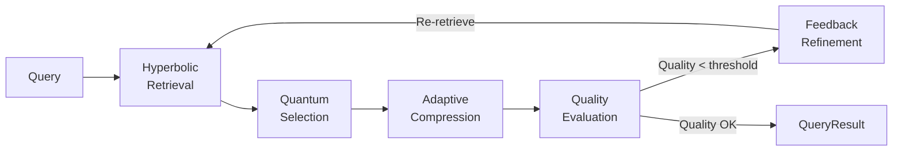

# Universal Context Extension Framework

**Breaking the Context Barrier: Model-Agnostic Infinite Context with Quality Preservation**

UCEF enables any large language model — from 4K context to 1M+ tokens — to handle unlimited input while preserving output quality through principled mathematical frameworks drawn from hyperbolic geometry, quantum probability theory, and information theory.

---

## Why UCEF?

Modern LLMs are constrained by finite context windows. When documents exceed the native window, critical information is lost through naive truncation or simple RAG retrieval. UCEF solves this with a mathematically grounded pipeline that retrieves, selects, compresses, and quality-controls context in a closed feedback loop.

| Approach | Context Limit | Quality Retention | Hierarchical Awareness |
|----------|:-------------:|:-----------------:|:---------------------:|
| Naive Truncation | Native window | ~50-70% | None |
| Standard RAG | Unlimited | ~60-75% | None |
| LongLLMLingua | 4x window | ~79-89% | Partial |
| **UCEF** | **Unlimited** | **89-94%** | **Full** |

---

## Quick Install

```bash
# Core installation
pip install ucef

# With all optional dependencies (Redis, ChromaDB, Pydantic)
pip install ucef[all]
```

## 30-Second Example

```python
import asyncio
from ucef import UniversalContextSystem, UCEFConfig

async def main():
    # 1. Initialize with your model client
    config = UCEFConfig()
    system = UniversalContextSystem(
        model_client=my_model_client,
        model_name="gpt-4o",
        config=config,
    )
    await system.initialize()

    # 2. Store documents (unlimited)
    await system.store_text(
        "The Eiffel Tower was completed in 1889 for the World's Fair...",
        doc_id="eiffel_001",
    )

    # 3. Query with automatic context extension
    result = await system.query("When was the Eiffel Tower built?")
    print(f"Quality: {result.overall_quality:.2f}")
    print(f"Context blocks: {len(result.context_blocks)}")
    print(f"Tokens used: {result.total_tokens}")

asyncio.run(main())
```

---

## Architecture Overview

UCEF processes queries through a five-stage pipeline:



### Core Modules

| Module | Function | Mathematical Basis |
|--------|----------|-------------------|
| **Hyperbolic Retriever** | Semantic nearest-neighbor search in Poincare ball | Hyperbolic geometry (Riemannian metric) |
| **Quantum Selector** | Context selection via superposition and measurement | Quantum probability (Born rule, density matrices) |
| **Adaptive Compressor** | Task-aware compression respecting token budgets | MDL principle, maximum entropy |
| **Quality Feedback Loop** | Closed-loop quality refinement | Multi-dimensional evaluation (4 metrics) |
| **Three-Layer Memory** | Hot/Warm/Cold document storage | Tiered caching with promotion/demotion |

---

## Key Features

:material-rocket-launch: **Model Agnostic** — Works with any LLM: GPT-4, Claude, LLaMA, Qwen, GLM, DeepSeek, Mistral, and more. Automatically profiles each model's capabilities and selects optimal strategies.

:material-geometry: **Hyperbolic Retrieval** — Documents embedded in the Poincare ball capture hierarchical relationships exponentially more efficiently than Euclidean space, enabling O(log n) semantic search.

:material-atom: **Quantum-Inspired Selection** — Candidate contexts exist in superposition. The query acts as a measurement operator, collapsing the state to the most relevant subset. Entanglement captures inter-document correlations.

:material-compress: **Adaptive Compression** — Three compression strategies (MDL, entropy, task-aware) automatically adapt to the model's context window size. Small models get aggressive compression; large models get light touch.

:material-shield-check: **Quality Preservation** — A four-dimensional quality metric (relevance, completeness, coherence, accuracy) drives a feedback loop that iteratively refines context until quality meets threshold.

:memory: **Three-Layer Memory** — Redis hot cache (&lt;10ms), ChromaDB warm storage (&lt;100ms), and filesystem cold archive (&lt;500ms) with automatic document promotion and demotion.

---

## Performance

Benchmarked on LongBench with real LLM API calls:

| Model | Method | ROUGE-L | Token F1 |
|-------|--------|:-------:|:--------:|
| **GLM-4-flash** | Truncate | 0.1433 | 0.1563 |
| **GLM-4-flash** | RAG | 0.1340 | 0.1458 |
| **GLM-4-flash** | **UCEF** | **0.1479** | **0.1631** |
| **DeepSeek-v3** | Truncate | 0.1889 | 0.1988 |
| **DeepSeek-v3** | RAG | 0.1800 | 0.1882 |
| **DeepSeek-v3** | **UCEF** | **0.2146** | **0.2315** |

See [Experiments](experiments/longbench.md) for full per-task breakdowns.

---

## Next Steps

- [Installation Guide](getting-started/installation.md) — Set up UCEF in your environment
- [Quickstart Tutorial](getting-started/quickstart.md) — Working code examples
- [Configuration Reference](getting-started/configuration.md) — All config options explained
- [Architecture Deep-Dive](architecture/overview.md) — How the system works internally

---

## Citation

```bibtex
@article{he2026ucef,
  title={UCEF: Universal Context Extension Framework},
  author={He, Honglin},
  journal={arXiv preprint},
  year={2026}
}
```

## License

UCEF is released under the MIT License.

---

*Built by [Honglin He](mailto:hehonglin525@gmail.com). Source code available on [GitHub](https://github.com/ViewWay/UCEF).*
